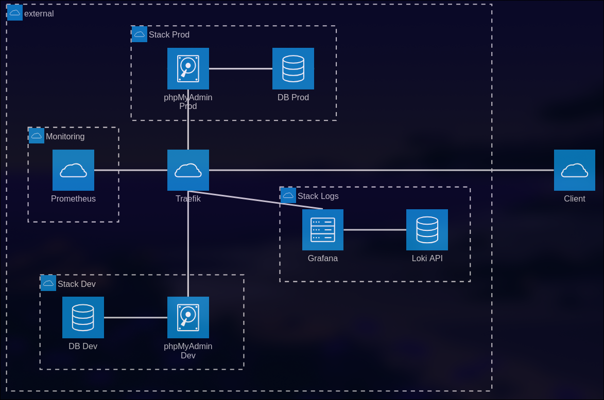

# controle-r5.a.09

## Schéma d'architecture



[](https://mermaid.live/edit#pako:eNp1k11vgjAUhv8KOVczUSNTUbjbZrIscYnZdjXxotIjNkBLSjHbjP995aMIfnDRcM77vD3tOXCEQFAED4gM9kxhoHKJgy0q4nNLP9UaSpGnViC4kiLGhyAWOe2t8Ueh5CTetKFUCmqAT0WCyFrpzMZivPG3cYqHLr3Aw104FmHWpZc6cxdPBGdKSMZDY3pvMjdM1ZqhPLAArXSfDsq7UJZFvbUO33-faKJdzX0KuWui29pDFNmSDHvrxfMt_rpU0YerSqYXWryqUxraZTpwF49FxFrwUofW0-qtxIuedulQkh3h5KGIUfbWr1Xcoi-OL0WCao95M5tVkylN5zlcWpUkuGOR8X1V4cVsupYgZsiVcbyU0cZAlegtrcHA-vDq3dstr1OGOB_d7GDGboh6omdRt7eltZpdNNkodQuNZKo-F-rXWb2hmfp3xbIi9CGUjIK-Yo59SFAmpAjhWPh80FdK0AdPv1IiIx98ftKelPBvIRJj0z9JuAdvR-JMR3mqvxBcMKKPlzRZiZyifBE5V-DZk8dZuQt4R_gBz3HcoT0bjSeu_WiP3PG8D7_gjSfO0B45znTujqfTieOe-vBXlh0N57Pp6R9VNnuq)

## Logs

L'interface grafana, connecté à l'API Loki, est accesible sur https://logs.td.anthonymoll.fr.

L'interface de monitoring de Prometheus, est accesible sur https://monitoring.td.anthonymoll.fr.

L'interface de Traefik est accesible sur http://traefik.td.anthonymoll.fr.


## Utilisation

``` bash
bash ./deploy.sh
```